# BPSK modulator

## Introduction
This module was written on my way of studying and practising FPGA design. Given my background in wireless communication, I found implementing various transmission and reception structures in FPGA particularly interesting. The best way to really learn something is by doing, so I started a project to implement a Binary Phase Shift Keying (BPSK) transmitter. This simple digital modulation scheme is ideal for gaining practical experience in digital signal processing. 
BPSK is the simpliest case of phase shift keying (PSK), a scheme of digital modulation that allows to transmit data by changing the phase of a carier wave by 180 degrees. The simplicity of this modulation scheme makes it the most noise-immune and robust among all PSKs. However, it can modulate only 1 bit/symbol, which makes it applicable only for low-data-rate applications such as the Internet of Things (IoT).
This transmitter module is designed for FPGA and a high-speed digital-to-analog converter (DAC). The module was developed and optimized for the high-speed AD/DA [AN108 Alinx module](https://alinx.com/public/upload/file/AN108_User_Manual.pdf), in combination with the Spartan 6 xc6slx16 chip. The module is designed in a way to demonstrate different stages of the signal conversion that occurs in the transmitter. A key feature of this module is that each of these stages can be connected to the DAC and observed at the output using an oscilloscope or spectrum analyzer.

## General Description
The figure below shows the structural diagram of the transmitter. Perhaps some elements in its structure are not necessary for a simple example, but these are the elements whose operation was most interesting for me to study and practice. 

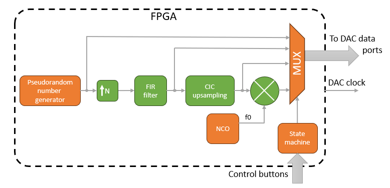

As the first iteration of the transmitter design, it was decided not to implement the transmission of real data, but to use a **pseudorandom number generator**. At the output of this generator, we have a data sequence of signed 8-bit numbers with values ​​​​1 `8'b0000001` and -1 `8'b11111111`. The sample rate of such a sequence is 1 megasample per second (MSPS). Then it is increased to 4 MSPS using an **upsampler** with upsampling factor _N_ equal to 4 for subsequent filtering by a **FIR filter**. This filtering stage is necessary to narrow the signal spectrum. The next stage is another increase in the sampling frequency with simultanious filtration. Sample rate is increasing from 4 to 80 MSPS, which is the clock frequency of the DAC. At this stage, filtration allows us to suppress images of the signal that appears during the upsampling with zero-order hold (ZOH). It is performed with the use of a cascaded integrator–comb (**CIC**) filter. After all the filtering steps the signal is mixed with the carrier frequency represented by the sinusoidal signal coming from a numerically controlled oscillator (**NCO**). All the signals that are connected to the multiplexer (**MUX**) can be sent to the DAC to observe their waveform. The MUX is controlled via **state machine**, whose state is defined by pressing four external buttons.

### Random bit generator
The structure of this block is shown in the figure below. 

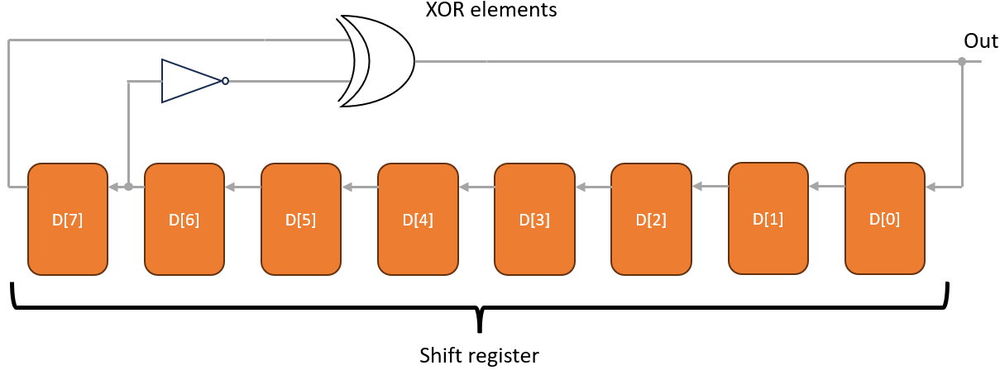

It is a polynomial pseudo-random generator based on a linear feedback shift register. Register is implemented as a series of required numbers of flip-flops that are wired together. Some bits of the shift register are used as inputs to the XOR or XNOR gate. The output of the XOR is then used as feedback to the first bit of the register as well as the output of the generator. When the register is running, the pattern that is generated is pseudo-random. It cannot be fully random because the system is deterministic and its next state can be calculated from the current state, so the generated sequence has a repeat period. The length of a generated sequence depends on the length of the register. A longer register, the bigger the sequence. In my current realization, I use an 8-bit register. Polynomials were taken from the [Xilinx application note](http://www.xilinx.com/support/documentation/application_notes/xapp052.pdf).

### Upsampler
This module performs upsampling of the input signal. For this module, the input clock frequency is the frequency of the upsampled signal. Upsampling can be implemented with ZOH or by setting new samples to zero.

### FIR filter
IP block with FIR filtration. Filter use 9 tap vector:`[0,17,38,57,64,57,38,17,0]`. An addition explanation will be added after the replacement of these IP blocks with a self-written one.

### CIC filter
IP block of the upsampling CIC filter with differential delay equal to 1, upsampling factor 20 and 4 stages. An addition explanation will be added after the replacement of these IP blocks with a self-written one.
Since the CIC filter contains a lot of summarizing operations, the output is a 24-bit bus. To fit the 8-bit DAC data input, the result of the filtration is divided by '16'd8192', and all higher bits (24-14) are just discarded. !!!!!!!!!!!!!!!!!!!

### NCO
IP block that generates sinusoidal signal with 8-bit resolution. Output frequency, fout, is a function of a clock frequency (fclk = 80 MHz), phase accumulator counter width (Bn = 16-bit) and phase increment (Inc = `16'd8192`). It can be defined in Hertz with the following formula: $\ fout = \frac{fclk Inc}{2^{Bn}}$. With all current settings the output frequency is equal to 10 MHz.
An addition explanation will be added after the replacement of these IP blocks with a self-written one.

### Mixer
Ideal mixer that uses an IP block with a DSP48A slice for two input signal multiplication. The mixer solely utilizes the multiplier within the DSP48A module. Since the bit inputs for the multiplier are 8-bit numbers, the result of the multiplication is a 16-bit number. To fit the 8-bit DAC data input the result of the multiplication is divided by `16'd128` and all higher bits (16-15) are just discarded.

## Theory of Operation
Of course, this is just a simple example of a BPSK transmitter; however, there are a few things that should be covered in detail. 

### Pulse-shaping
Each communication system has a limited bandwidth. It can be caused by the limitations of the communication channel (cables, antennas) and the passband bandwidth of different elements of the communication system (filters, amplifiers, and antenna elements). However, using regular digital signals like series of pulses or levels of voltages (like in the Non Return to Zero code) can cause an unacceptable level of intersymbol interference. This happens when the bandwidth of the communication system is smaller than the signal bandwidth. An example of such an effect is shown below.

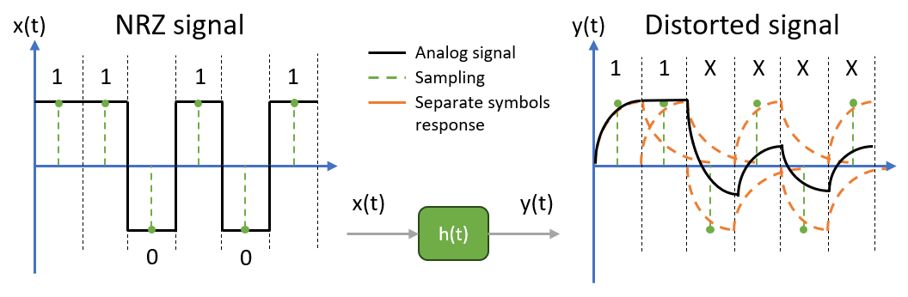

With such a distortion, one symbol interferes with subsequent symbols. The presence of ISI in the communication system introduces errors in the decision device at the receiver output that result in an increase of a bit error rate.

Limitations in signal bandwidth can be dictated not only by the bandwidth of the channel itself but also by the close proximity of adjacent communication channels. Thus, demands on signal bandwidth are required by the different communication standards. In this case, it is necessary to artificially reduce the bandwidth of the transmitting signal. Such a filtration also should not have an influence on the transmitted symbols.

Pulse shaping is performed in order to meet requirements in the signal bandwidth by artificial compressing the signal bandwidth without introducing ISI. This problem was discussed in detail by Niquist [!!!!!!!]. He showed that if each pulse of the data sequence has a $\ sinc(t/T) $ shape, pulses could be detected without an ISI. Such a pulse shaping can be performed with a filter with the required pulse response.

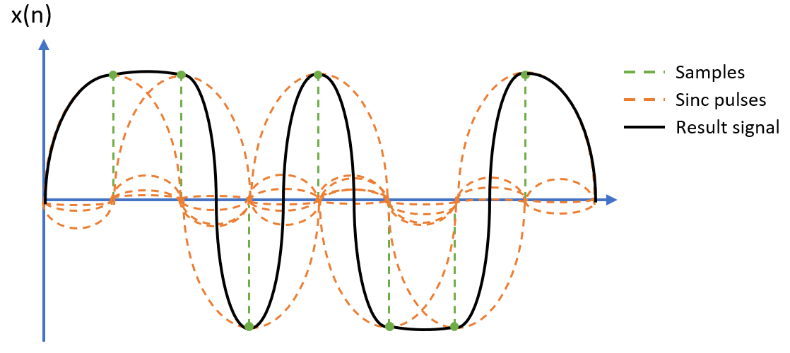

From the figure above, it can be seen that in each time period where we took a sample, "tails" from the adjusent pulses are equal to 0. As a result filter But here come the promlems; with such pulse's shape, time synchronization became critical. If the sampling period in the receiver differs from the transmitting data rate, it will introduce an error at the receiver side. But this is a topic for another project.

Of course, the ideal Nyquist channel impilse response is infinite in time and cannot be implemented. In practice, people usually use the version where "tails" of the sinc function attenuate rather than making the spectrum slightly wider. A filter with such an impulse response is called a Raised-Cosine (RC) filter. This filter can be easily implemented with a FIR filter by sampling the inpulse response.

It should be enoted that the transfer function of the whole channel should meet the Nyquist criteria. It means that the total impulse response of the system should have $\ sinc $ form. In cases where there is a filter on the transmitter and a receiver side, their total impulse response should be equal to the RC function. But each filter in separate has a transfer function that is a square root of the frequency response of the RC filter transfer function. Such a filter is called the Root-Raised-Cosine filter. It will not be implemented in his example since only transmitter architecture is considered here, but it will be covered in further projects. 

### Upsampling and anti-imaging filtration

Discrete signal, as well known, has a periodical spectrum. It is well seen when upsampling is performed. Upsampling allows to increase the sample rate of the signal and add higher-frequency components to the signal. By adding zero equal samples, we copy and shift the spectrum of the original signal in the frequency domain. Repeated copies of the signal in the frequency domain are called images.

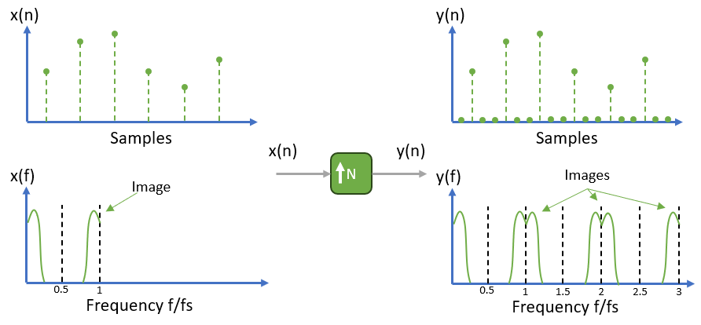

It's obvious from here that to reconstruct the signal, we need to filter its images with some sort of low-pass filter (LPF). Such filters are called anti-imaging filters or reconstruction filters. Such filters are usually applied at the output of a DAC. In theory, a DAC should output a series of pulses; in practice, it is more like a series of "steps,"  in other words, it has zero-order hold interpolation. As it can be seen from the figure below, it already attenuates images of the signal. The envelope of such a spectrum has a sinc shape with zeros at sample rate frequencies. The addition of a reconstruction LPF smooths out the steps (removes harmonics above the cutoff frequency) to restore the analog signal corresponding to the digital time domain.

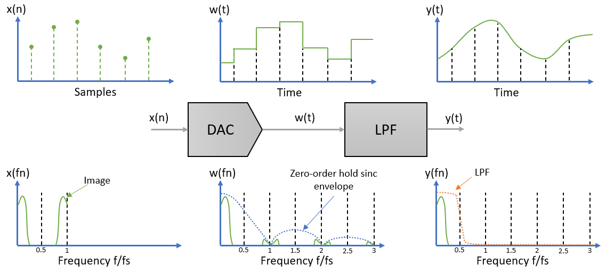

In my current project, the same process happens in the digital domain. Because I am mixing signals in a FPGA, it is necessary to upsample the signal up to the sample rate of the carrier sinusoid (that is, the sample rate of the DAC). Inside the FPGA, this was performed with the help of the CIC filter.

### CIC compensation filter

CIC filters have a very wide transition region over the passband, and their usage is suitable for narrow band signals. However, this filters are extrimmely efficient and required only adders and shift registers for implementation. In combination with the FIR filter, it is possible to increase the passband and slope of the result response. Such a compensation FIR filter design should be done together with the [design of the CIC filter](https://cdrdv2-public.intel.com/653906/an455.pdf). Example of such compensation is on the figure below.

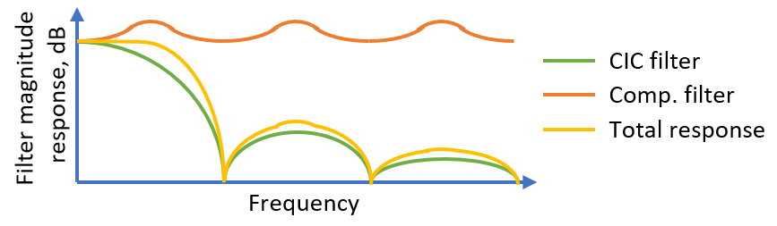

## How to use
To replicate this project, follow the steps below. Ensure you have an FPGA evaluation board with a high-speed DAC board connected to it. This example uses a Spartan 6 FPGA, but the instructions are adaptable for other boards with slight modifications.

### Prerequisites:
1. **FPGA Evaluation Board** – Any FPGA evaluation board with sufficient resources to handle the project. This project was developed using the **Spartan 6 xc6slx16**.
2. **High-Speed DAC Board** – In this case, the **AD/DA AN108 Alinx module** was used.
3. **Software Tools** – Install the appropriate software tool for your FPGA model:
   - **Xilinx FPGAs**: ISE Design Suite (for older models like Spartan 6) or Vivado.
   - **Altera FPGAs**: Quartus Prime.

### Steps:

1. **Set Up Your Development Environment:**
   - Install the **ISE Design Suite** or **Vivado** if you're using a Xilinx FPGA. For Spartan 6, **ISE Design Suite** was used.
   - If you are using an Altera board, install **Quartus Prime**.
   - Set up your project in the FPGA development environment by selecting the correct target FPGA model.

2. **Clone the Repository:**
   - Download or clone the current repository to your local machine.
   - Add all the Verilog files (such as `main.v`, `data_generator.v`, `upsampler.v`, etc.) to your project. Ensure that all dependencies are included.

3. **Regenerate IP Blocks (if required):**
   - If you are using an FPGA board different from the Spartan 6 or a DAC board different from the AD/DA AN108 Alinx, you may need to regenerate some of the IP blocks (e.g., CIC filter, FIR filter, NCO, modulator). Follow the instructions in your FPGA toolchain to regenerate these blocks, ensuring they are configured to match the specifications of your board.

4. **Compile the Project:**
   - Once all the Verilog files and IP blocks are added, compile the project within your FPGA toolchain.
   - During compilation, check for any errors or warnings, particularly related to mismatched IP block configurations if you've modified them.

5. **Pin Assignment:**
   - After successful compilation, map the inputs and outputs of the module to the appropriate pins on your FPGA board. Pay special attention to the following:
     - **Clock Pin**: Ensure that the main clock input (`clk_50MHz_i`) is connected to the correct pin for your FPGA's clock signal.
     - **Button Pins**: Assign the reset and control buttons (e.g., `button_reset`, `button_key1`) to physical buttons on the FPGA board.
     - **DAC Output Pins**: Map the `dac_data` and `dac_clock` signals to the appropriate pins connected to the DAC board.

6. **Upload the Bitstream to the FPGA:**
   - Once the pin assignments are complete, generate the bitstream and upload it to the FPGA. In **ISE Design Suite**, use the "Generate Bitstream" option, and in **Vivado/Quartus**, use the equivalent option for bitstream generation.

7. **Connect the DAC and Monitor Output:**
   - After programming the FPGA, ensure the DAC board is properly connected to the FPGA evaluation board.
   - Using an **oscilloscope** or **spectrum analyzer**, observe the DAC’s output for the upsampled data signals.
     - In the initial stages, the **pseudorandom data** generated by the module will be visible.
     - By pressing the control buttons on the FPGA, you can switch between different stages of the signal conversion (upsampled data, filtered data, modulated signal).

8. **Troubleshooting and Optimization:**
   - If the output does not appear as expected, verify the following:
     - The correct clock signal is applied to the FPGA.
     - The pin assignments are correctly mapped.
     - The DAC board is properly powered and connected.
   - You can also tweak the **upsampling factor** or apply different **filtering techniques** if required for your specific hardware setup.

## Technical Challenges

One of the primary challenges you may face when replicating this project is related to FPGA resources, specifically **DSP slices**. Some of the IP blocks used in this project rely on **Digital Signal Processing (DSP) slices**, which contain built-in hardware multipliers. These multipliers are essential for building components such as the **FIR filter** and the **modulator**.

### Resource Constraints:
FPGAs with a large number of DSP slices are often expensive. Many entry-level or amateur FPGA evaluation boards are limited to a maximum of 32 DSP slices. If your FPGA does not have enough DSP slices, there are two options:
1. **Use Registers and LUTs**: If the DSP slices are insufficient, you can generate the needed functionality using simpler blocks like **Registers** and **Look-Up Tables (LUTs)**. However, this will consume additional FPGA resources, reducing the amount available for other tasks.
2. **Choose an FPGA with More Resources**: Below is a table of the utilised FPGA resources for this project:

| **Component**       | **Used** |
|---------------------|----------|
| DSP Slices          | 10       |
| LUTs                | 247      |
| LUT Flip Floops	    | 317      |
| MUXCY               | 116      |
| Registers           | 331      |
| Block RAM (BRAM)    | 20       |

It is recommended to choose an FPGA with these or higher amounts of slices to ensure smooth replication of the project.

## Test example
An example of the measurement setup is shown on a figure below.

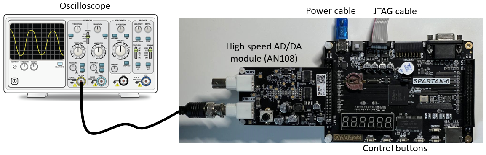

DAC output can be controlled by pressing four input buttons. The first button will show data bits. They are upsampled with ZOH to the sample rete of the DAC. It can be seen that the bandwidth of such a signal attenuates pretty fast with frequency increase but can still be decreased with the pulse shaping with a FIR filter. 

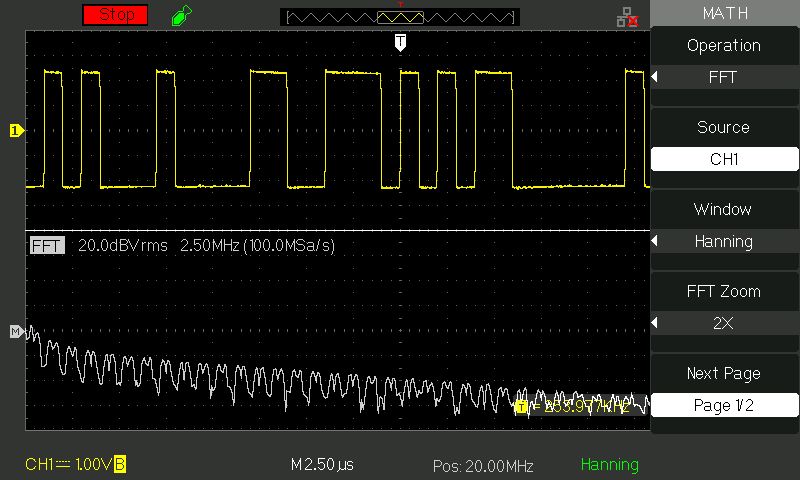

The second button will switch to the result of the pulse shaping. Output samples are also upsampled to the DAC samplerate with ZOH. After pulse shaping, the spectrum of the signal became narrower. Because of the ZOH approximation at the DAC output, we can see multiple copies of the signal spectrum across the frequency.

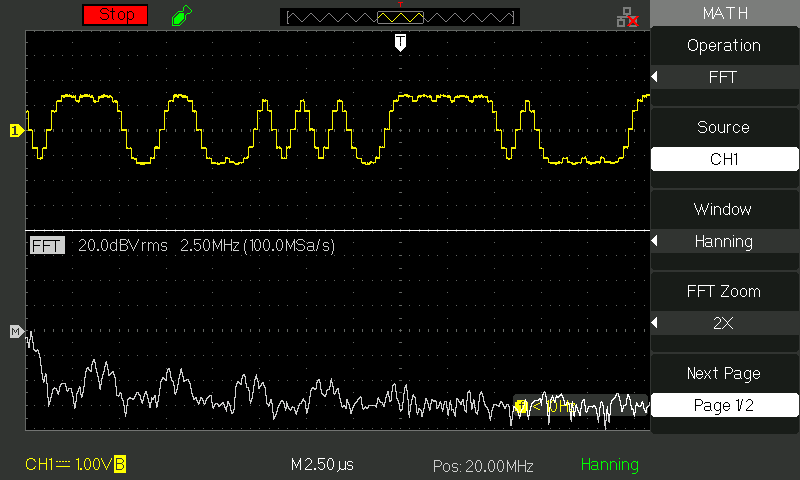

Third demonstrates anti-imaging filtration. This is a baseband signal and can be used as it is even for mixing in hardware with external mixing circuits. Anti-imaging filtration smoothed out the signal and suppressed the images in the frequency domain. Now the signal spectrum is concentrated around 0 Hz.

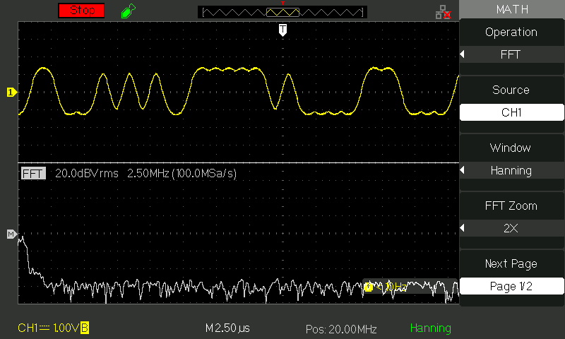

CIC filters have strong bandpass attenuation. After pulse shaping, we see that all the symbols correspond to a certain voltage. But after CIC filtration for the samples, where the signal is rapidly changing between 1 and -1 (that corresponds to the 010101 sequence in the transmitted data), it does not reach the required level.This is a result of an ISI. An additional FIR filter for compensation of the CIC transfer function is required and will be added in the future.

 And finally, the last fourth button switches DAC to the modulated signal. The signal spectrum was shifted to the 10 MHz frequency. Such a passband signal is ready for transmission or further hardware processing.

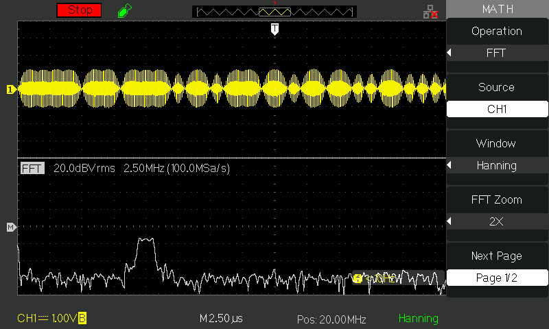

### Source Files Discription

| **Source file** | **Description** |
| --- | --- |
| main.v | Top level module |
| button.v | Button processing |
| state_machine.v | Control state machine |
| data_generator.v | Pseudo-random data generator |
| upsampler.v | Upsampler module |

| **Folder** | **Discription** |
| --- | --- |
| md_images | Folder with figures for README file and screenshots from oscillograph |
| ipcore_dir | Folder with generated IP cores for such modules as: CIC filer, FIR filter, NCO, and modulator |

### Pin Description

| **Pin** | **Direction** | **Active level** | **Size (bit)** | **Description** |
| --- | --- | --- | --- | --- |
| clk_50MHz_i | input | - | 1 | Main clock frequency of the FPGA |
| button_reset | input | low | 1 | Global reset button |
| dac_data| output | - | 8 | Data bus for the DAC |
| dac_clock | output | - | 1 | Clock output for DAC |
| button_key1 | input | low | 1 | Control for the state machine that control DAC output |
| button_key2 | input | low | 1 | ~ |
| button_key3 | input | low | 1 | ~ |
| button_key4 | input | low | 1 | ~ |
| status_led | output | - | 4 | Display current state of the state machine |

# Future work
- [] Adjusting the carrier frequency
- [] CIC filter compensation
- [] Control via UART
- [] Data transmission
- [] Replace all IP blocks with custom-designed ones
- [] Display information on a 7-segment display

